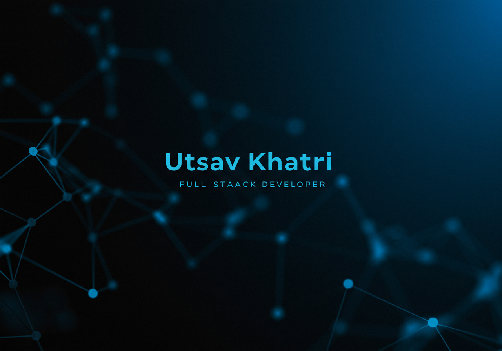

# Utsav Khatri - Full Stack Developer Portfolio

[](https://nextjs.org/)
[](https://www.typescriptlang.org/)
[](https://tailwindcss.com/)
[](https://ui.shadcn.com/)
[](https://vercel.com/)

This repository contains the source code for my personal portfolio website, built to showcase my skills, projects, and experience as a Full Stack Developer.

<!-- Optional: Add a screenshot or GIF of your portfolio here -->
<!-- e.g., <p align="center"></p> -->

## Live Demo

[utsav-khatri.vercel.app](https://utsav-khatri.vercel.app)

## About Me

I'm Utsav Khatri, a dynamic and results-oriented Full Stack Developer with comprehensive experience in designing, developing, and deploying scalable, cloud-native web applications and robust APIs. I have proven expertise in React.js, Node.js, Next.js, TypeScript, and various cloud services (AWS, Cloudflare). I'm passionate about leveraging cutting-edge technologies to solve complex business challenges, foster team growth, and I have a keen interest in the practical applications of AI in web development.

This portfolio is a testament to my dedication to building high-impact digital products and my journey in the ever-evolving tech landscape.

## Features

This portfolio is packed with modern web features:

- **Next.js 15 App Router:** Leveraging the latest Next.js features for optimal performance and developer experience.
- **TypeScript:** For robust, maintainable, and scalable code.
- **Responsive Design:** Adapts beautifully to all screen sizes, from mobile to desktop.
- **Dark/Light Mode:** User-selectable theme preference, powered by `next-themes`.
- **shadcn/ui & Tailwind CSS:** Modern and utility-first styling for a sleek and customizable UI.
- **Interactive Animations:** Engaging user experience with `anime.js`.
- **3D Background Effect:** A captivating "Matrix" style data stream on the hero section using `Three.js`.
- **Smooth Scrolling:** Enhanced navigation experience with `@studio-freight/lenis`.
- **Dynamic Project Showcase:**
  - Featured projects with custom details.
  - Ability to load and display other public projects from my GitHub profile (`getRemainingPublicProjects`).
- **Comprehensive Sections:**
  - **Hero:** An engaging introduction.
  - **About Me:** Detailed information about my background and passion.
  - **Skills:** An interactive display of my technical toolkit.
  - **Experience:** Professional journey and key projects.
  - **Projects:** A curated list of my work.
  - **Contact Form:** Functional contact form using Next.js API Routes and `Nodemailer`.
- **SEO Optimized:** With dynamic metadata generation for better search engine visibility.
- **Organized Code Structure:** Clear separation of components, sections, and utilities.

## Tech Stack

- **Frontend:**
  - [Next.js](https://nextjs.org/) (v15 with App Router, Turbopack for dev)
  - [React](https://reactjs.org/) (v19)
  - [TypeScript](https://www.typescriptlang.org/)
  - [Tailwind CSS](https://tailwindcss.com/) (v4)
  - [shadcn/ui](https://ui.shadcn.com/)
  - [anime.js](https://animejs.com/) (Animations)
  - [Three.js](https://threejs.org/) (3D Graphics for Hero Section)
  - [Lucide React](https://lucide.dev/) & [@iconify/react](https://iconify.design/) (Icons)
  - [next-themes](https://github.com/pacocoursey/next-themes) (Theming)
  - [@studio-freight/lenis](https://github.com/studio-freight/lenis) (Smooth Scrolling)
- **Backend (Contact Form):**
  - Next.js API Routes
  - [Nodemailer](https://nodemailer.com/)
- **Validation:**
  - [Zod](https://zod.dev/)
- **Development & Build Tools:**
  - npm/yarn/pnpm/bun
  - ESLint
- **Deployment:**
  - [Vercel](https://vercel.com/) (Recommended)

## Getting Started

To get a local copy up and running, follow these simple steps.

### Prerequisites

- Node.js (v20 or later recommended)
- npm, yarn, pnpm, or bun

### Installation

1.  **Clone the repository:**

    ```bash
    git clone https://github.com/Utsav173/MyPortfolio.git
    cd MyPortfolio
    ```

2.  **Install dependencies:**
    Choose your preferred package manager:

    ```bash
    npm install
    # or
    yarn install
    # or
    pnpm install
    # or
    bun install
    ```

3.  **Set up Environment Variables:**
    Create a `.env.local` file in the root of the project and add the following variables. You can use the `.env.example` (if provided) as a template.

    ```env
    # For the contact form
    GMAIL_USERNAME=your_gmail_address@gmail.com
    GMAIL_PASS=your_gmail_app_password
    CONTACT_FORM_RECEIVER_EMAIL=your_personal_email_to_receive_messages@example.com

    # For fetching GitHub projects (Optional, but recommended to avoid rate limits)
    # Create a Personal Access Token (PAT) on GitHub with `public_repo` scope.
    GITHUB_TOKEN=your_github_personal_access_token

    # For generating absolute URLs (e.g., for metadata, sitemap)
    NEXT_PUBLIC_SITE_URL=https://utsav-khatri.vercel.app
    ```

    _Note on `GMAIL_PASS`_: It's highly recommended to use an "App Password" for Nodemailer if you have 2-Step Verification enabled on your Google account. [Learn more here](https://support.google.com/accounts/answer/185833).\*

4.  **Run the development server:**
    ```bash
    npm run dev
    # or
    yarn dev
    # or
    pnpm dev
    # or
    bun dev
    ```

Open [http://localhost:3000](http://localhost:3000) with your browser to see the result. You can start editing the page by modifying `src/app/page.tsx`. The page auto-updates as you edit the file.

### Building for Production

```bash
npm run build
# or
yarn build
# or
pnpm build
# or
bun build
```

This will create an optimized production build in the `.next` folder.

## Learn More About Next.js

To learn more about Next.js, take a look at the following resources:

- [Next.js Documentation](https://nextjs.org/docs) - learn about Next.js features and API.
- [Learn Next.js](https://nextjs.org/learn) - an interactive Next.js tutorial.

You can check out [the Next.js GitHub repository](https://github.com/vercel/next.js) - your feedback and contributions are welcome!

## Deploy on Vercel

The easiest way to deploy your Next.js app is to use the [Vercel Platform](https://vercel.com/new?utm_medium=default-template&filter=next.js&utm_source=create-next-app&utm_campaign=create-next-app-readme) from the creators of Next.js.

Check out the [Next.js deployment documentation](https://nextjs.org/docs/app/building-your-application/deploying) for more details. Remember to set up your environment variables in the Vercel project settings.

## Author

**Utsav Khatri**

- **GitHub:** [@Utsav173](https://github.com/Utsav173)
- **LinkedIn:** [Utsav Khatri](https://linkedin.com/in/utsav-khatri-in)
- **Email:** [khatriutsav40@gmail.com](mailto:khatriutsav40@gmail.com)

## License

This project is open source. Feel free to fork, star, and contribute. If you use significant portions of the code, please give credit. (Consider adding an MIT License file if you wish to specify terms).
